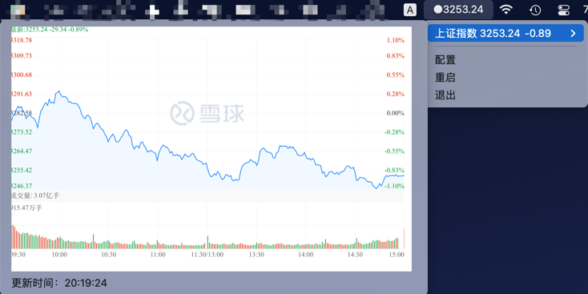

# 股票监控应用 - macOS版本

一个专为macOS设计的股票监控应用，支持A股、美股、港股实时价格监控和投资收益计算。

## 📱 截图


## ✨ 功能特性

- **实时监控**: 支持A股、美股、港股实时价格
- **智能提醒**: 自定义价格监控规则和回本提醒
- **系统托盘**: 原生macOS系统托盘集成
- **投资收益**: 自动计算持仓收益和收益率
- **Apple Silicon**: 原生支持M1/M2/M3芯片

## 🚀 快速开始

### 系统要求
- macOS 10.14+
- Xcode命令行工具

### 编译安装

```bash
# 安装Xcode命令行工具（如果未安装）
xcode-select --install

# 编译当前架构
CC=clang go build -o stock-monitor ./main.go

# 编译Apple Silicon版本
GOOS=darwin GOARCH=arm64 CC=clang go build -o stock-monitor-arm64 ./main.go

# 编译Intel Mac版本
GOOS=darwin GOARCH=amd64 CC=clang go build -o stock-monitor-amd64 ./main.go

# 创建通用二进制文件（同时支持Intel和Apple Silicon）
GOOS=darwin GOARCH=arm64 CC=clang go build -o stock-monitor-arm64 ./main.go
GOOS=darwin GOARCH=amd64 CC=clang go build -o stock-monitor-amd64 ./main.go
lipo -create stock-monitor-arm64 stock-monitor-amd64 -output stock-monitor-universal
```

### 运行应用

```bash
# 前台运行（调试模式）
./stock-monitor --daemon=false --log-level=debug

# 后台运行（默认）
./stock-monitor
```

## ⚙️ 配置说明

配置文件位置：`~/.config/StockMonitor.json`

| 字段                |   类型   | 是否必填 |   示例   |                      说明                       |
|-------------------|:------:|:----:|:------:|:---------------------------------------------:|
| code              | string |  是   | 000001 |                     股票代码                      |
| type              |  int   |  否   |   1    | 股票类型<br/>0-深A, 1-沪A, 105-美股1, 106-美股2, 116-港股 |
| cost              | float  |  否   | 10.5   |                     持仓成本                      |
| position          | float  |  否   |  1000  |                     持仓数量                      |
| name              | string |  否   |  平安银行  |                 股票名称（自动获取）                   |
| showInTitle       |  bool  |  否   |  true  |               是否在标题栏显示，默认 false               |
| enableRealTimePic |  bool  |  否   | false  |             是否启用时分图，默认 false                |
| monitorRules      | array  |  否   | ["> 11.00"] |              价格监控规则                         |

### 配置示例
```json
[
  {
    "code": "000001",
    "type": 0,
    "cost": 10.50,
    "position": 1000,
    "name": "平安银行",
    "showInTitle": true,
    "enableRealTimePic": false,
    "monitorRules": ["> 11.00", "< 9.50"]
  }
]
```

## 🎯 使用技巧

### 菜单操作
- **左键点击**: 查看股票详情和操作菜单
- **右键点击**: 快速访问配置和应用设置

### 监控规则
支持以下格式的监控规则：
- `> 10.5` - 价格大于10.5时提醒
- `< 9.0` - 价格小于9.0时提醒
- 自动回本提醒（持仓成本价格监控）

### 命令行选项
```bash
./stock-monitor --help

选项:
  --daemon=false          前台运行
  --log-level=debug       启用调试日志
  --config=/path/to/config.json  指定配置文件
```

## 🐍 Python工具脚本

项目包含两个重要的Python维护脚本：

### 股票数据更新
```bash
# 拉取最新的股票列表数据
cd utils/assets
python pull_all_stock.py
```

### 持仓自动同步
```bash
# 从东方财富账户同步持仓信息（需要配置环境变量）
export EAST_MONEY_USER="你的用户名"
export EAST_MONEY_SEC="你的密码"
python update_stock_monitor_by_easemoney.py
```

## 🔧 故障排除

### 编译问题
```bash
# 确保Xcode命令行工具已安装
xcode-select --install

# 检查Go环境
go version
```

### 运行问题
```bash
# 检查权限
chmod +x ./stock-monitor

# 前台运行查看错误
./stock-monitor --daemon=false --log-level=debug
```

### 通知权限
如果通知不工作：
1. 系统偏好设置 > 通知
2. 找到股票监控应用
3. 启用通知权限

## 📝 更新日志

### v2.0.0
- 🍎 专门为macOS优化
- ⚡ Apple Silicon原生支持
- 🛡️ 增强的错误处理和重试机制
- 📊 改进的性能监控
- 🔧 简化的编译和部署流程

---

**专为macOS用户优化 🍎**